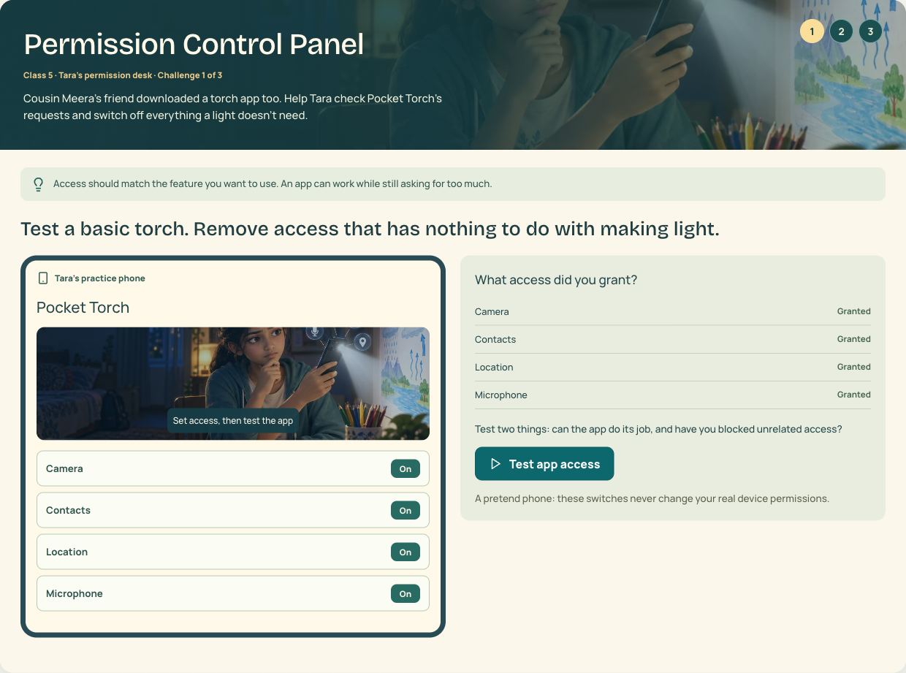
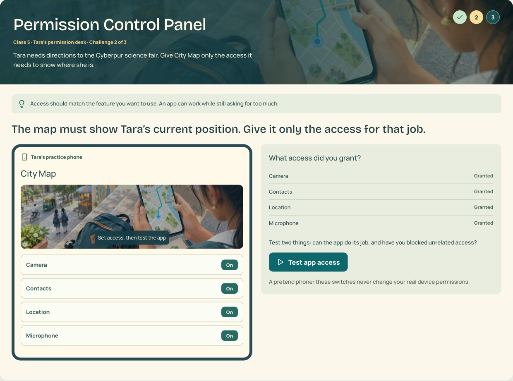
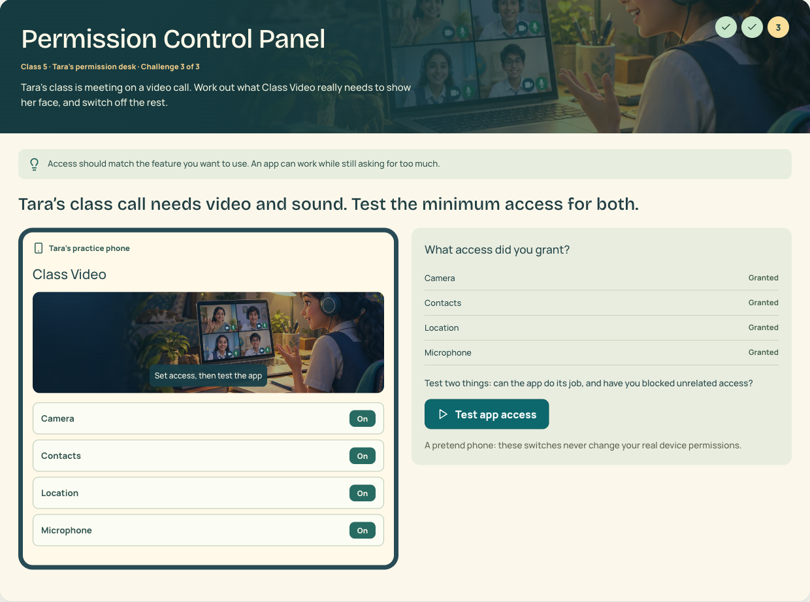
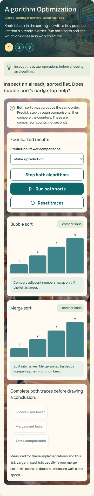

# Site visual review — 29 September 2026

Local checkout: `/Users/dipeshkumar/Downloads/CyberSuraksha-claude/cybersuraksha`  
Preview: http://localhost:3200

## Reviewed coverage

- All 24 cyber chapters across the three bands: every six-scene story and all three practice challenges.
- Desktop at 1280px and phone at 390px, including retry feedback, solved states, completion and reset.
- Homepage, teacher/student login, school registration, dashboards, class navigation and anonymous portal redirects.
- Authenticated roster, assignment list/composer/results, student assignments, teacher results and individual learning reports.
- The six additional module entry screens (Badal and Moti, Double Century Vault, Nani Maa Vacation Challenge, Secret Message Rescue, Toy Workshop and Sample).
- The English/math curriculum was not audited exercise by exercise. This was a visual and interaction review of the cyber curriculum and shared site surfaces, not a new LMS grading/security audit.

## Changes

| Area | Improvement |
|---|---|
| Complex Algorithmic Logic | New report-card debugging classroom illustration replaces the generic robot workshop in the practice header and work area. |
| Algorithm Optimization | New athletics finish-line illustration replaces unrelated robot/cricket imagery in the sorting practice. |
| Permissions | Torch, map and video-call tasks each show their own illustration in the header and app preview. |
| Email Header Inspector | Scholarship inbox and school project illustration replaces the unrelated phone desk. |
| Recommendation Rabbit Hole | Illustrated personalised video feed replaces the generic fairground backdrop. |
| OTP Guardian / Digital Arrest | Reuses the existing relevant family-call and pretend-caller artwork. |
| Safety practice headers | Fixes CSS specificity that prevented chapter-specific illustrations from appearing. Applies across the safety chapters. |
| Homepage reduced motion | Removes entrance animation delays that temporarily concealed content when reduced motion was enabled. |
| Teacher/student portals | Closed Guide launcher sits below content, keeping grades and forms clear. Its open panel retains the existing behaviour. |
| Keyboard skip link | Clips the unfocused link so it cannot appear over practice screenshots; keyboard focus still reveals it. |
| Secret Message Rescue | Constrains the lesson rail so its nine-step navigation scrolls within the phone screen instead of widening the whole page. |
| Forms | Native fallback submissions use POST, preventing fields from appearing in URL query strings before hydration. |

The approved moonbase story, chapter story scripts, narration, scoring and interactions were preserved.

## Generated artwork

Seven original assets generated with the built-in `image_gen` tool, exported to self-hosted WebP:

- `public/cyber-missions/refined/report-card-workshop.webp`
- `public/cyber-missions/refined/sports-day-sort.webp`
- `public/cyber-missions/refined/torch-permissions.webp`
- `public/cyber-missions/refined/city-map-permission.webp`
- `public/cyber-missions/refined/class-video-permission.webp`
- `public/cyber-missions/refined/scholarship-inbox.webp`
- `public/cyber-missions/refined/recommendation-feed.webp`

Generation briefs: [site-visual-review-prompts.json](site-visual-review-prompts.json). Attribution/provenance: `public/cyber-missions/ASSET-CREDITS.md`. Labels, scores and choices stay in the interface rather than being baked into images.

## Verification

- `node scripts/practice-qa.cjs`: passed **48 flows / 144 challenge runs**, including retries, images, overflow, completion and reset. Added regression checks for the corrected chapter art and each permission stage.
- `node scripts/chapter-visual-qa.cjs` plus its approved-vault-only run: passed **24 chapters / 288 rendered story scenes**, including interactive story tasks, pause and reduced motion.
- `node --test tests/rendered-html.test.mjs`: **8 passed**, including the POST-form regression check.
- Final production build with the configured Node 24 runtime: passed.
- The six additional module entry screens passed image/error/overflow checks at both widths after repairing Secret Message Rescue’s mobile rail.
- Public/portal desktop and phone navigation passed. Teacher report/detail views passed again after moving the Guide launcher.
- Targeted skip-link practice run passed at both widths; a keyboard Tab check confirmed the link remains visible on focus.
- `git diff --check`: passed.
- Impeccable detector ran on changed UI targets. Its remaining findings concern incumbent accent borders/chart height animation and decorative backgrounds; these were not a reason to replace the approved visual system.

Browser QA used chapter previews and existing local demo accounts. It did not publish assignments or create new student learning records.

## Selected previews

